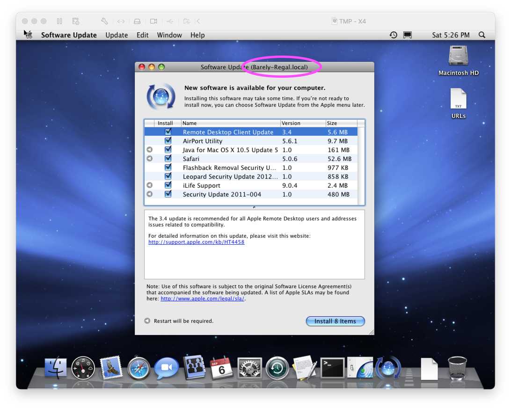
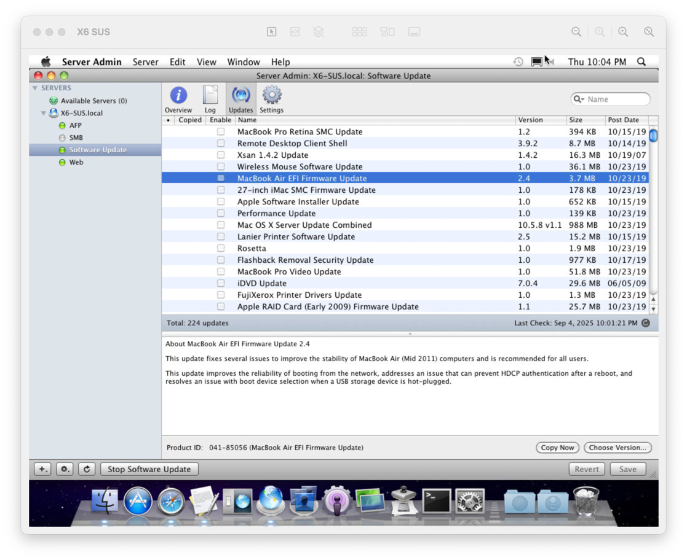
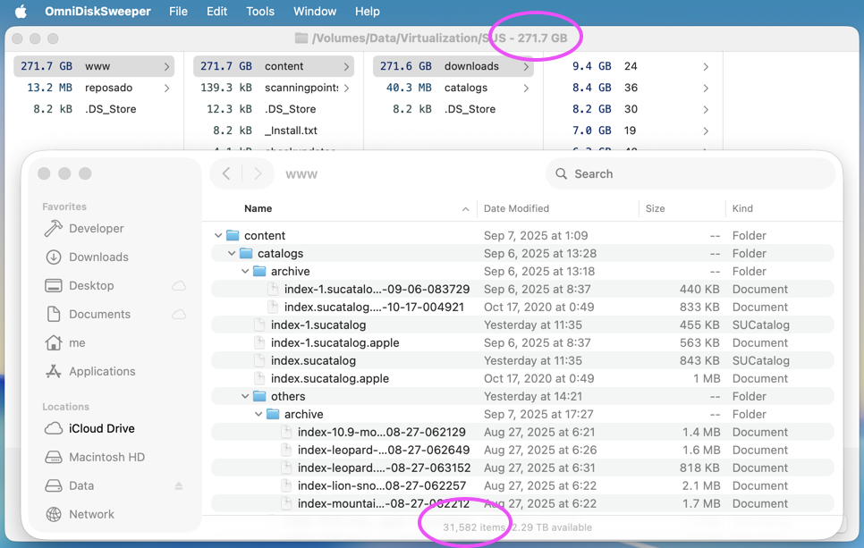

# Retro Software Update Server

A guide on setting up an Apple Software Update Server Mirror in case Apple ever
decides to shut down these old update servers. So far software update still
works on Mac OS X 10.4 and above, but Apple already shut down servers for 10.3,
10.2, 10.1, and 10.0 and those can't be recovered.

If you have an interest in retro Macs, this may be something you would like to
set up in case something bad were to happen. This approach works because these
servers are still online and still work. If you happen to be reading this 10
years in the future (2035) because Apple shut down the software update servers
for PowerPC Macs, then its too late. Sorry.

## Who Am I

I'm Jeff, a fan of Mac OS X, NeXT, a software developer, and general retro tech
enthusiast. I have other retro tech guides as well as software I have developed
for retro Macs, so please check it out.

- [MathEdit for OpenStep](https://github.com/jeffreybergier/MathEdit)
   - [MathEdit Development Posts on my Mastodon](https://jeffburg.social/tags/OpenStep)
- [Retro Stream Tutorial](https://github.com/jeffreybergier/Retro-Stream-Tutorial)
- [iMac G4 Posts on my Mastodon](https://jeffburg.social/tags/iMacG4)
- [Homemade iMac 5K Monitor posts on my Mastodon](https://jeffburg.social/tags/iMac5K)

## How do Software Updates Work on the Mac



The software update system for Mac OS X 10.4 and higher is actually amazingly
simple and flexible. For 10.3 and lower, it was a traditional client/server
application. The client would send some information about itself to the server
and the server would process this and tell the client what updates it needed.
While this seems logical, it also means your servers will be busy processing
requests from clients. And as Apple started to become really successful at
selling Macs in the early 2000s the OS X team probably realized that this would
fail to scale.

So what did they change? Well, in 10.4 and later, the Software Update Server is
nothing more than a huge set of files and a few Update catalogs... one for each
version of the OS. These sucatalog files listed every update available as well
as "distribution" files. These distribution are available in for every supported
language they contain the localized description but also they contain inline
javascript that will be executed by the client to determine if the update is
needed.

What this means is Apple offloaded all of the work of determining which updates
it needs from the server to the client. This is great for Apple's server load,
but it also explains why checking for updates can take so long the first time.
The client literally needs to download hundreds of distribution files. Yes, they
are only a few K each, but then the client also needs to execute the javascript
for each one.

The other side-effect of this system is that now it is easy to mirror the
software update server as there is no server side logic

**Enter Mac OS X Server Software Update Server**

Back in the day, Apple included a Software Update Server as part of Mac OS X
Server. Apple intended companies to use this to mirror the software updates
internally in a company to do 2 things:

1. Save bandwidth when updating a fleet of Macs 1. Control which updates were
available to the Macs in your company to ensure that you could test
compatibility first

This feature is long dead and now Apple facilitates the same control by allowing
companies to white list or blacklist updates via MDM (Mobile Device Management).
This does not create a mirror, but simply tells client Macs to ignore updates.
This method does not save bandwidth in your company. But in the modern day,
bandwidth is a lot less expensive than it used to be.

When I first started this project, I actually tried to use 10.6 Snow Leopard
Server to host the software update server. However, after much troubleshooting,
I could not get it to download the updates reliably. It would only download
about 1/3 of the updates which is not enough for success. I don't know why it
refused to download them. All it said was there was a suspected security problem
and so it refused. ChatGPT suggested that the Apple Software Update Server
distributed with their OS had very picky client-side URL validation and if the
URL's failed these basic checks, it would not even start the download.

**Enter [Reposado](https://github.com/wdas/reposado/blob/main/docs/getting_started.md)**

Reposado is an open source project written in Python 2 that replicates the
functionality of the software update server. It checks the Apple catalogs,
downloads the updates, and then generates new catalogs specific to your mirror.
In my experience doing this, it seems to work super well. So this guide will
explain how to set this up for you so you can prepare for the very dark day when
Apple shuts down these old software updates \(which may never come\).

## Approach / Guide / Table of Contents

1. Install Git, Homebrew, Python2
1. Choose where Software Updates will be mirrored on your server Mac
1. Configure the Web Server on your server Mac
1. Configure Reposado on your server Mac
1. Use Reposado to mirror Apple's existing software updates to your server Mac
1. Configure the retro Mac to fetch updates from your server Mac

## System Requirements

**Server Mac**

1. 50GB+ to dedicate to storing updates
   - Even the minimal set for 10.4 Tiger is 20GB
   - Supporting all the way to 10.9 Mavericks takes 200GB
   - ChatGPT says that around 10.11/10.12 Apple started locking down the 
     software update server and it can't be changed
1. A normal home network
   - This guide assumes you connect all your Macs to the internet with ethernet 
     or WiFi and they can find eachother and connect to eachother using Bonjour 
     names.

**Retro Mac**

1. Connected to Ethernet or WiFi on the same network as your server Mac
1. Mac OS X 10.4 or higher

Note that the server Mac can really be any system. Even modern Linux \(such as 
Debian and Ubuntu\) automatically identify themselves via Bonjour names. But
this guide gives instructions when using a Mac as the server.

# Guide

This guide pretty much runs 100% from Terminal. 
Any text `in this special format` is a terminal command you can copy and paste.

## 1. Install Git, Homebrew, Python2

- Git is included as part of the Xcode command line utilities AND these utilties
are required for Homebrew anyway.

```xcodeselect --install```

- HomeBrew is a simple package manager for macOS. Its easy to install. 
Just follow the guide on [https://brew.sh](https://brew.sh). Make sure to 
follow the instructions in the Terminal after installing HomeBrew.
They are required to make sure that commands you install via homebrew are
easily launchable from the Terminal.

```/bin/bash -c "$(curl -fsSL https://raw.githubusercontent.com/Homebrew/install/HEAD/install.sh)"```

### Python2

This is the difficult one. Python2 is far out of date and HomeBrew no longer
has an easy installer for it. We have to use PyEnv and this basically seemed
to build Python2 from source, which is never fun.

**Install PyEnv and other tools needed for compiling**

```brew install pyenv zlib bzip2 readline openssl@1.1```

**Configure the environment for python2 build**

```
export LDFLAGS="-L$(brew --prefix zlib)/lib -L$(brew --prefix bzip2)/lib -L$(brew --prefix readline)/lib -L$(brew --prefix openssl@1.1)/lib"
export CPPFLAGS="-I$(brew --prefix zlib)/include -I$(brew --prefix bzip2)/include -I$(brew --prefix readline)/include -I$(brew --prefix openssl@1.1)/include"
export PKG_CONFIG_PATH="$(brew --prefix zlib)/lib/pkgconfig:$(brew --prefix bzip2)/lib/pkgconfig:$(brew --prefix readline)/lib/pkgconfig:$(brew --prefix openssl@1.1)/lib/pkgconfig"
```

**Configure your shell to use PyEnv**

Sorry you may need to look up the commands
for how to use `vi` or use a text editor you know better like `nano`

```vi ~/.zshrc```

Paste in the following text and then save and exit

```
export PATH="$HOME/.pyenv/bin:$PATH"
eval "$(pyenv init --path)"
eval "$(pyenv init -)"
```

**Compile Python2**

```pyenv install 2.7.18```

**Set Python2 as the default**

```pyenv global 2.7.18```

**Test Python**

You should not get an error when running this command

```python -version```

## 2. Choose where Software Updates will be mirrored on your server Mac

The Software Update application on your Mac expects a very specific directory
structure and catalog format. Reposado creates this for you. But you still
need to decide where on your system this will go and you will also need
to configure the web server to use this directory. It is OK to have this on
an external drive as the mirror takes a lot of space.

On my system I put everything in 

`/Volumes/Data/Virtualization/SUS`

So the Web Server Document Root and Reposado Storage is

`/Volumes/Data/Virtualization/SUS/www`

Reposado git clone is

`/Volumes/Data/Virtualization/SUS/reposado`

Reposado Metadata storage is

`/Volumes/Data/Virtualization/SUS/reposado/code/metadata`

So you can put everything wherever you like, but this guide assumes this
structure

## 3. Configure the Web Server on your server Mac

Mac OS X has always included Apache as a web server, its just disabled by 
default. Its nothing fancy, but it will work for our retro Mac.

**Set DocumentRoot to the directory you selected above**

`sudo vi /etc/apache2/httpd.conf`

This file is pretty long so you have to scroll down to find the DocumentRoot
setting. I don't think you need to change other options, but I here are the key
ones.

```
DocumentRoot "/Volumes/Data/Virtualization/SUS/www"
<Directory "/Volumes/Data/Virtualization/SUS/www">
    Options Indexes FollowSymLinks
    AllowOverride All
    Require all granted
</Directory>
```

**Give the webserver full disk access**

This might not be needed if you your directory root is on the boot drive
but I definitely needed it because mine is on an external drive.

1. Open System Settings→Privacy→Full Disk Access
1. Click the plus button and enter your admin password
1. Press ⌘+Shift+G in the file picker and type `/usr/sbin/httpd`

**Turn on the Web Server**

`sudo launchctl load -w /System/Library/LaunchDaemons/org.apache.httpd.plist`

**Test the Web Server**

Put a test file in the document root. It can be any file, but perhaps a small
`.txt` file is easiest.

1. Open Safari on your Server Mac and type `http://localhost/mytestfile.txt`
1. Open Safari on your Retro Mac and type ``http://Server-Bonjour-Name.local/mytestfile.txt`

Note that step 2 is critical. If you can't get the website to load on your
Retro Mac you won't be able to update from it either.

## 4. Configure Reposado on your server Mac

Ok, Reposado is where all the magic happens, so lets get started!

**Clone the [Reposado](https://github.com/wdas/reposado) Repository**

```
cd /Volumes/Data/Virtualization/SUS
git clone https://github.com/wdas/reposado.git
```

**Configure Reposado**

`/Volumes/Data/Virtualization/SUS/reposado/code/repoutil --configure`

Reposado will ask you for the directories you chose earlier. Note if you drag in
the directories from the Finder, it appends a space after them and the developer
of Reposado says this will cause errors.

```
Filesystem path to store replicated catalogs and updates [None]: /Volumes/Data/Virtualization/SUS/www
Filesystem path to store Reposado metadata [None]: /Volumes/Data/Virtualization/SUS/reposado/code/metadata 
Base URL for your local Software Update Service
(Example: http://su.your.org -- leave empty if you are not replicating updates) [None]: Server-Bonjou-Name.local
```

**Configure Reposado (Continued)**

Reposado defaults to being a production software update server mirror, which is
not what you want because you are setting up a retro software update mirror in
case of catastrophe. And you probably don't want to take 400+GB of updates for
all modern Macs when you could use less than 100GB to support updating 10.6,
10.5, and 10.4 only.

`open /Volumes/Data/SUS/reposado/code/preferences.plist` (TextEdit should open)

Your configuration file will look something like this. Copy and paste the keys
listed below into your configuration and then customize them as you like:

- **AppleCatalogURLs** to the bare minimum for 10.4 Tiger only (we will expand later after we confirm its working)
- **PreferredLocalizations** to include the languages you care about
- **RepoSyncLogFile** so you can see sync progress and verify everything is working

```xml
<?xml version="1.0" encoding="UTF-8"?>
<!DOCTYPE plist PUBLIC "-//Apple//DTD PLIST 1.0//EN" "http://www.apple.com/DTDs/PropertyList-1.0.dtd">
<plist version="1.0">
<dict>
	<key>LocalCatalogURLBase</key>
	<string>http://Barely-Regal.local</string>
	<key>UpdatesMetadataDir</key>
	<string>/Volumes/Data/Virtualization/SUS/reposado/code/metadata</string>
	<key>UpdatesRootDir</key>
	<string>/Volumes/Data/Virtualization/SUS/www</string>
	<key>AppleCatalogURLs</key>
    <array>
    <string>http://swscan.apple.com/content/catalogs/index.sucatalog</string>
    <string>http://swscan.apple.com/content/catalogs/index-1.sucatalog</string>
    </array>
    <key>PreferredLocalizations</key>
    <array>
    <string>English</string>
    <string>en</string>
    <string>Japanese</string>
    <string>ja</string>
    </array>
    <key>RepoSyncLogFile</key>
    <string>/var/log/reposado_sync.log</string>
    <key>HumanReadableSizes</key>
    <true/>
</dict>
</plist>
```

**Create the Log File**

Create the log file and make it readable and writable by all users. Normally it
would be better to make it readable and writable by the right people, but its a
single log file. Not really security critical.

`sudo touch /var/log/reposado_sync.log`
`sudo chmod 777 /var/log/reposado_sync.log`

**You're Ready to Roll!**

In the next section we will fire this thing up and updates will start to stream
in!

## 5. Use Reposado to mirror Apple's existing software updates to your server Mac

First we will do a test run with the minimal set of Software Update Catalogs
that you configured in the previous section. This is about 20-25GB worth of
updates, so depending on how fast or slow your internet connection is, this
could take a while. Reposado does not generate the catalogs for your retro Mac
to use until it has finished downloading everything, so you need to wait until
it finishes. This is why we start with the minimal catalogs.

**Tail the log so you can see the progress**

Open a new terminal window or tab and run this command to view the log as it
gets updated.

`tail -f /var/log/reposado_sync.log`

**Start the Software Update Sync**

`/Volumes/Data/Virtualization/SUS/reposado/code/repo_sync`

Thats it. Now you have to wait for it to download 20GB or so. You should be able
to see progress in the other terminal window with the tailed log file.

**What Success Looks Like**

The log file will output hundreds of lines, so you may be wondering what success
looks like. After downloading all of the files, Reposado will build the catalog
files and then report `repo_sync run ended`. It will look something like this.

```
Sep 07 17:26:44 Could not get data from dist file: /Volumes/Data/Virtualization/SUS/content/downloads/03/09/061-5359/mxWDL8cXkFTv9pCp8GMFr2bJFXjtqyQbvx/022-4184.English.dist
Sep 07 17:26:46 Could not replicate http://swcdn.apple.com/content/downloads/49/33/061-6390/BYBbD3TFbdpntDts78ddSzDSRpXnGKnQsy/FinalCutPro6.0.6Update.smd: Error 22: The requested URL returned error: 403
Sep 07 17:26:51 Building index.sucatalog...
Sep 07 17:26:51 WARNING: did not add product 061-1688 to catalog index.sucatalog.apple because it has not been downloaded.
Sep 07 17:26:51 WARNING: did not add product 061-2736 to catalog index.sucatalog.apple because it has not been downloaded.
Sep 07 17:26:51 WARNING: did not add product 061-1720 to catalog index.sucatalog.apple because it has not been downloaded.
Sep 07 17:26:51 WARNING: did not add product 041-85067 to catalog index.sucatalog.apple because it has not been downloaded.
Sep 07 17:26:51 WARNING: did not add product 061-6390 to catalog index.sucatalog.apple because it has not been downloaded.
Sep 07 17:26:51 WARNING: did not add product 061-2006 to catalog index.sucatalog.apple because it has not been downloaded.
Sep 07 17:26:51 WARNING: did not add product 061-5359 to catalog index.sucatalog.apple because it has not been downloaded.
Sep 07 17:26:51 WARNING: did not add product 061-2193 to catalog index.sucatalog.apple because it has not been downloaded.
Sep 07 17:26:52 178 products found in http://swscan.apple.com/content/catalogs/index-1.sucatalog
Sep 07 17:26:53 Building index-1.sucatalog...
Sep 07 17:26:54 268 products found in http://swscan.apple.com/content/catalogs/others/index-leopard.merged-1.sucatalog
Sep 07 17:26:55 Building index-leopard.merged-1.sucatalog...
Sep 07 17:26:56 345 products found in http://swscan.apple.com/content/catalogs/others/index-leopard-snowleopard.merged-1.sucatalog
Sep 07 17:27:05 Building index-leopard-snowleopard.merged-1.sucatalog...
Sep 07 17:27:08 600 products found in http://swscan.apple.com/content/catalogs/others/index-lion-snowleopard-leopard.merged-1.sucatalog
Sep 07 17:27:37 Building index-lion-snowleopard-leopard.merged-1.sucatalog...
Sep 07 17:27:38 448 products found in http://swscan.apple.com/content/catalogs/others/index-mountainlion-lion-snowleopard-leopard.merged-1.sucatalog
Sep 07 17:27:42 Building index-mountainlion-lion-snowleopard-leopard.merged-1.sucatalog...
Sep 07 17:27:43 464 products found in https://swscan.apple.com/content/catalogs/others/index-10.9-mountainlion-lion-snowleopard-leopard.merged-1.sucatalog
Sep 07 17:27:57 Building index-10.9-mountainlion-lion-snowleopard-leopard.merged-1.sucatalog...
Sep 07 17:27:58 repo_sync run ended
``` 

Warnings will be normal as some updates will not be available any longer. If the
number of products not downloaded is HUGE like, hundreds of items, then you have
a problem. But I think 10 or 20 is normal?

**Choose Max Version of OS X You Want Updates For**

This is a personal choice based on what Macs you are interested in, how much
space you have to dedicate to this, and what Macs you think Apple will remove
from the update servers soonest.

You can see all the catalogs in this [Reposado file.](https://github.com/wdas/reposado/blob/main/docs/reposado_preferences.md)
They are named in a pretty orderly way, so select which OS you want to support
and then put in the catalog file for that one and all the versions lower. So if
you want to support 10.10 Yosemite and lower, your Preferences.plist would look
like this:

```
<key>AppleCatalogURLs</key>
<array>
    <string>http://swscan.apple.com/content/catalogs/index.sucatalog</string>
    <string>http://swscan.apple.com/content/catalogs/index-1.sucatalog</string>
    <string>http://swscan.apple.com/content/catalogs/others/index-leopard.merged-1.sucatalog</string>
    <string>http://swscan.apple.com/content/catalogs/others/index-leopard-snowleopard.merged-1.sucatalog</string>
    <string>http://swscan.apple.com/content/catalogs/others/index-lion-snowleopard-leopard.merged-1.sucatalog</string>
    <string>http://swscan.apple.com/content/catalogs/others/index-mountainlion-lion-snowleopard-leopard.merged-1.sucatalog</string>
    <string>https://swscan.apple.com/content/catalogs/others/index-10.9-mountainlion-lion-snowleopard-leopard.merged-1.sucatalog</string>
    <string>https://swscan.apple.com/content/catalogs/others/index-10.10-10.9-mountainlion-lion-snowleopard-leopard.merged-1.sucatalog</string>
</array>
```

After you add the new catalogs, run sync again

`/Volumes/Data/Virtualization/SUS/reposado/code/repo_sync`

Note that supporting up to 10.10 Yosemite takes abut 300GB of space



**Some Final Things**

Basically, after you complete the sync, you never need to Reposado again. The
webserver and the `www` folder are all you need. The Software Update server is
based off of a completely static system, which is super nice and reliable.

If you change the hostname of the server Mac, you can update the
Preferences.plist file and then run sync again, and it won't download any new
files, but at the end Reposado will update the catalog files to use your new
hostname which is fantastic.

## 6. Configure the retro Mac to fetch updates from your server Mac

So this is a bit tricky, because its likely that your retro Mac(s) have already
run all of their software updates. So when you tell them to check for updates
from your new Software Update Server Mirror, the retro Mac will still tell you
there are no updates available. So how do you test?

- If you don't mind erasing your retro Mac you could just reinstall the OS -
Install a fresh OS to an external firewire hard drive and boot from that -
Install and old version of OSX in a Virtual Machine and try that

**Configure the Retro Mac**

All of these have their pros and cons so you decide. But once you get the Mac
working and it is ready for software updates, run the following command in the
terminal on the retro Mac

`sudo defaults write /Library/Preferences/com.apple.SoftwareUpdate CatalogURL "http://Server-Bonjour-Name.local/content/catalogs/others/index-lion-snowleopard-leopard.merged-1.sucatalog"`

Note that you have to point the OS at the correct catalog given the version of
OS X you are running or else it won't see all of the updates.

**Tail the Apache Access Logs on the Server Mac**

Tailing these logs will show you the retro Mac is checking all the updates.

`tail -f /var/log/apache2/access_log /var/log/apache2/error_log`

**Check for Updates on the Retro Mac**

Check for updates on your retro Mac and install them. If its a fresh install, it
may take several reboots to get through all the updates.

`Apple Menu→Software Update`

**What Success Looks Like**

In the logs on the server Mac, you should see a lot of access. Like hundreds of
files to check for updates. On the retro Mac, in the title of the Software
Update window you should see the hostname of your server Mac in parentheses. See
the screenshot below.


**Some Final Things**

In the real software update server, Apache rewrite rules are used so any version
can fetch index.sucatalog and the server will smartly rewrite the URL to be the
correct one. You can add these if you like, but since you're probably not
running an army of retro Macs, its probably easier to just do it on the retro
Mac instead. Here are the rewrite rules if you are interested.

```
RewriteEngine On
RewriteCond %{HTTP_USER_AGENT} Darwin/9
RewriteRule ^/index\.sucatalog$ /index-leopard.merged-1.sucatalog
RewriteCond %{HTTP_USER_AGENT} Darwin/10
RewriteRule ^/index\.sucatalog$ /index-leopard-snowleopard.merged-1.sucatalog
RewriteCond %{HTTP_USER_AGENT} Darwin/11
RewriteRule ^/index\.sucatalog$ /index-lion-snowleopard-leopard.merged-1.sucatalog
```

